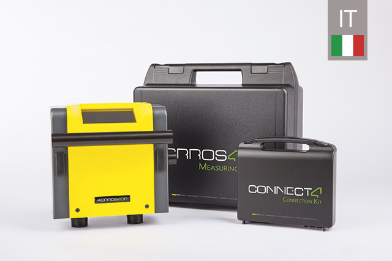

# **Korrostop4.0** - _informazioni in italiano_

## Che cos’è **Korrostop4.0**

_**Korrostop4.0**_ è un dispositivo affidabile e preciso per la misurazione di conduttanza, temperatura e flusso dell’acqua deionizzata dopo il trattamento con il sistema _**E.KO IONISER**_. Il dispositivo di misurazione [_**Korrostop4.0**_](https://www.easymetal.com/it/prodotti/korrostop-40/korrostop-40.html) è esclusivamente progettato per l’utilizzo con un sistema  [_**E.KO IONISER**_](https://www.easymetal.com/it/prodotti/eko-ioniser/settori-di-utilizzo.html) [_**easymetal**_](https://www.easymetal.com/it.html). Non è consentito l’utilizzo di _**Korrostop4.0**_ con altri sistemi di deionizzazione. Qualora _**Korrostop4.0**_ venga indebitamente utilizzato con prodotti (sistemi di deionizzazione) di altri fornitori, saranno addebitati a posteriori i costi relativi ai diritti di licenza che risultano coperti solo in caso di utilizzo con _**E.KO IONISER 1501/1502/1503**_ .

Inizialmente concepito per l’uso industriale nel [trattamento dell’acqua per i tagli a elettroerosione](https://www.easymetal.com/it/settori-di-applicazione/edm/utilizzo-nel-settore-edm.html) _**l'E.KO IONISER**_ con _**Korrostop4.0**_ , grazie all’elevata qualità, viene sempre più di frequente utilizzato in altri settori.

La combinazione di _**E.KO IONISER**_ e _**Korrostop4.0**_ è compatibile con tutti gli apparecchi per EDM di qualsiasi produttore e, grazie ai suoi molti canali, offre un’integrabilità totale nel vostro sistema informatico aziendale esistente.  _**Korrostop4.0**_ è il dispositivo di misurazione ideale per perfezionare l’automazione dei processi nella vostra azienda. Si vedano anche le [**Funzioni**](../../wiki/Tutte-le-funzioni).

> L’attuale versione **SYS412002** è uscita il 28.01.2020. Si vedano anche le [Versioni](../../wiki/Versioni).

## Qui potrete trovare:
* [Informazioni](../../wiki) costantemente aggiornate su **Korrostop4.0**
* [Updates](Updates) per il meccanismo di aggiornamento delle schede SD
* [Specifiche](../../wiki) sul **Korrostop4.0**
* [Tools e Source Code](IntegrationSamples) per l’automazione con **Korrostop4.0**
* Per le altre lingue si vedano anche i [relativi archivi](https://github.com/easymetal?tab=repositories)

## Gruppi target delle pagine:
* **Interessati**: informazioni sulle funzioni
* **Clienti**: consultazione del manuale, aggiornamenti...
* **[Commercianti](https://www.easymetal.com/it/ricerca-rivenditori.html)**: casi d’uso e riferimenti per richieste specifiche del cliente
* **Partner**: casi d’uso e specifiche
* **Sviluppatori** nel settore dell’automazione dei processi e dell’integrazione: esempi tipici e specifiche

> Immagine: **Korrostop4.0** sul **E.KO IONISER 1501** 

_© 2020 by [easymetal](https://www.easymetal.com/it.html)_

## Collegamento con codice QR:
* a questa pagina _(https://github.com/easymetal/Korrostop4.0-IT)_: **[Images/qrIT.png](Images/qrIT.png)**
* alle pagine Wiki  _(https://github.com/easymetal/Korrostop4.0-IT/wiki)_: **[Images/qrWiki.png](Images/qrWiki.png)**
* alle pagine GitHub di easymetal _(https://github.com/easymetal)_: **[Images/qrEasymetal.png](Images/qrEasymetal.png)**
* alle pagine GitHub di easymetal _(https://www.easymetal.com/it.html)_: **[Images/qrWEB.png](Images/qrWEB.png)**
